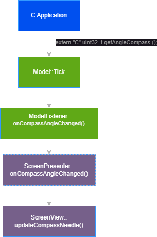
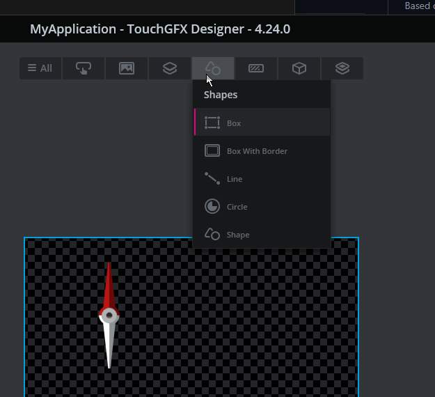
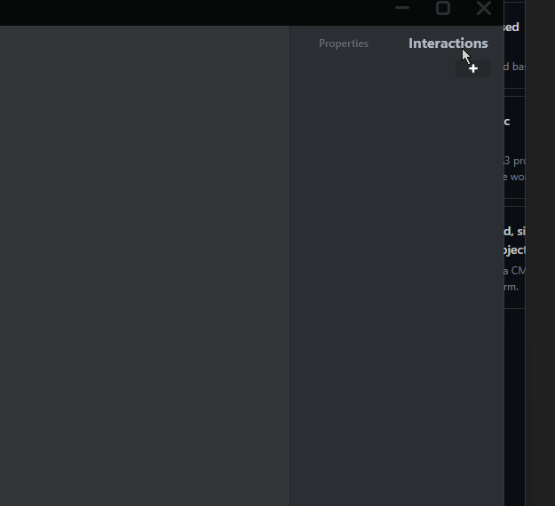
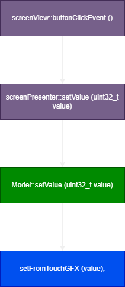

## Показване на променена стойност от `C` проект в/у екрана

#### 1.  Добавяме в `TouchGFX\gui\src\model\Model.cpp` 

класът `Model` служи за връзка с външната апликация - в случая тоят проект

```cpp
#include <gui/model/Model.hpp>
#include <gui/model/ModelListener.hpp>

extern "C" uint32_t getAngleCompass ();
extern "C" void setFromTouchGFX (uint32_t value);

static uint32_t angleCompass = -1UL;
static uint32_t varRead;

Model::Model () : modelListener (0)
{
}

void Model::tick ()
{
    // handle the angleCompass value
    if (getAngleCompass () != angleCompass)
    {
        angleCompass = getAngleCompass ();
        modelListener->onCompassAngleChanged (angleCompass);
    }
    // ...
}

```


`Model::tick ()` се изпълнява при от TouchGFX библиотеката и се извиква на 1 mS.

в фукцията проверяваме за промяна на стойността върната от `getAngleCompass` и ако има промяна извиквам `modelListener->onCompassAngleChanged (angleCompass);`

тя оведомява **екранът който е показан на дисплея** че стойността е променена.  


#### 2.  `ModelListener` -  този клас се наследява от `ScreenPresenter` на всяка станица която си създал.

Трябва да дефинираш функции които да извикаш при определени събития. Hапример : при промяна на стойността за ъгълът на компаса в проекта трябва да извикаш функцията `onCompassAngleChanged`


`TouchGFX\gui\include\gui\model\ModelListener.hpp`

```cpp
#ifndef MODELLISTENER_HPP
#define MODELLISTENER_HPP

#include <gui/model/Model.hpp>

class ModelListener
{
public:

    ModelListener () : model (0) {}

    virtual ~ModelListener () {}

    void bind (Model * m)
    {
        model = m;
    }

    // --------------------------- User Events ----------------------------

    /// \brief Compass angle changed event
    /// \param value
    virtual void onCompassAngleChanged (uint32_t value) {}

protected:

    Model * model;
};

#endif        // MODELLISTENER_HPP

```


#### 3. `Screen View`/Screen Presenter

Както виждаш в директорията на всеки Screen има 2 файла

`screenView.hpp`, `screenPresenter.cpp`

 класът `ScreenPresenter` служи за връзка с `Model`   , той наследява `ModelListener` като потребителските събития които са дефинирани могат да бъдат пренаписани. И те ще бъдат активни доката екранът е активен.

в конктртният случай при промяна на стойността на `angleCompass` 


 

`screenPresenter.hpp` 

```cpp
#ifndef SCREENPRESENTER_HPP
#define SCREENPRESENTER_HPP

#include <gui/model/ModelListener.hpp>
#include <mvp/Presenter.hpp>

using namespace touchgfx;

class screenView;

class screenPresenter : public touchgfx::Presenter, public ModelListener
{
public:

    screenPresenter (screenView & v);

    /**
     * The activate function is called automatically when this screen is "switched in"
     * (ie. made active). Initialization logic can be placed here.
     */
    virtual void activate ();

    /**
     * The deactivate function is called automatically when this screen is "switched out"
     * (ie. made inactive). Teardown functionality can be placed here.
     */
    virtual void deactivate ();

    virtual ~screenPresenter () {}

private:

    screenPresenter ();

    screenView & view;

    // --------------------------- User Events ----------------------------

    /// \brief Compass angle changed event
    /// \param value
    /// \pre overridden from Model Listener
    void onCompassAngleChanged (uint32_t value) override;
};

#endif        // SCREENPRESENTER_HPP

```

`screenPresenter.cpp` 

```cpp
#include <gui/screen_screen/screenPresenter.hpp>
#include <gui/screen_screen/screenView.hpp>

screenPresenter::screenPresenter (screenView & v)
                                : view (v)
{
}

void screenPresenter::activate ()
{
}

void screenPresenter::deactivate ()
{
}

void screenPresenter::onCompassAngleChanged (uint32_t value)
{
    view.updateCompassNeedle (value);
}

```


`screenView.hpp`

```cpp
#ifndef SCREENVIEW_HPP
#define SCREENVIEW_HPP

#include <gui/screen_screen/screenPresenter.hpp>
#include <gui_generated/screen_screen/screenViewBase.hpp>

class screenView : public screenViewBase
{
public:

    screenView ();

    virtual ~screenView () {}

    virtual void setupScreen ();
    virtual void tearDownScreen ();

    // ------------------------- User functions ---------------------------

    /// \brief Update compass needle
    /// \param value
    void updateCompassNeedle (uint32_t value);

protected:

private:

    uint32_t _positionX = 0;
};

#endif        // SCREENVIEW_HPP

```

`screenView.cpp`

```cpp
#include <gui/screen_screen/screenView.hpp>

screenView::screenView ()
{
}

void screenView::setupScreen ()
{
    screenViewBase::setupScreen ();
}

void screenView::tearDownScreen ()
{
    screenViewBase::tearDownScreen ();
}

void screenView::updateCompassNeedle (uint32_t value)
{
    // TODO: convert `value` to float ...

    float angle;
    textureMapperAngleCompass.setAngles (0, 0, angle);
    textureMapperAngleCompass.invalidate ();
}

```


## Промяна на стойност от екрана в `C`  проекта

наобратно е по-лесно

от Screen обработваш събитие (например от натиснат бутон). Извикваш функция от `screenPresenter` която от своя страна извиква функция от `Model` с нужният параметър.

Пример:

1. Добавям бутон
     
2. Назначавам функция която да се изпълни при натискане на бутона
    
3. Пренаписваме фукцията  `void buttonClickEvent ()` в [screenView.hpp](https://github.com/panchev68-Janko/NewColor/blob/c1f3a148c92330d78fb3040559bc228dc7980f83/TouchGFX/gui/include/gui/screen_screen/screenView.hpp#L29C5-L29C47)
4. Добавяме функция в `screenPresenter`  която ще изикаме от `screen` в случай че бутонът бъде натиснат
   [```void setValue(uint32_t value);```](https://github.com/panchev68-Janko/NewColor/blob/402bd98b53bf9d1572ec0b732bc3e487390e0cbb/TouchGFX/gui/src/screen_screen/screenPresenter.cpp#L22) 
5. Тя извиква функция от model [void Model::setValue (uint32_t value)](https://github.com/panchev68-Janko/NewColor/blob/402bd98b53bf9d1572ec0b732bc3e487390e0cbb/TouchGFX/gui/src/model/Model.cpp#L25)

 
